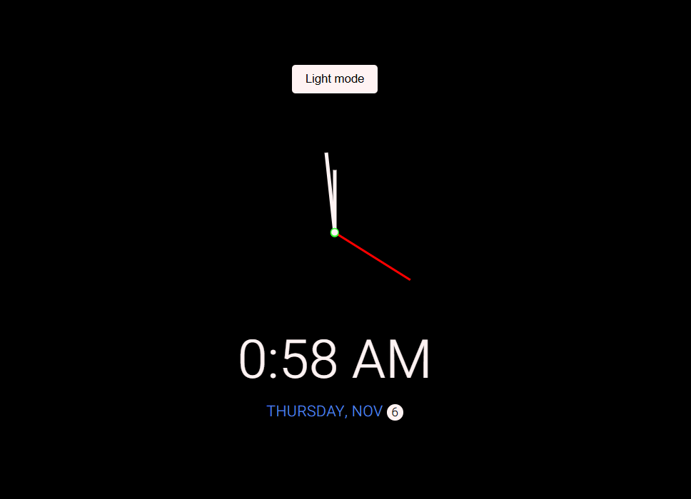

# 🕒 Simple Clock

    Inspired by this dribbble shot: https://dribbble.com/shots/5958443-Alarm-Clock
A minimal and elegant analog + digital clock built using **HTML**, **CSS**, and **JavaScript**.

---
## 👀 Preview

> Light and Dark mode preview of the clock interface

---

## 📖 Description
It is a clean and responsive web clock that shows both analog and digital time, along with the current date and day.  
It features a **light/dark mode toggle**, smooth analog hand movement, and a stylish centered layout — perfect for learning or showcasing DOM manipulation, CSS transforms, and date/time handling.

---

## ✨ Features
- 🕰️ Analog clock with smooth hour, minute, and second hands  
- 💻 Digital time display with AM/PM format  
- 📅 Shows current weekday and date  
- 🌗 Light/Dark mode toggle with saved preference  
- 📱 Fully responsive and minimal UI  
- ⚡ Built with only HTML, CSS, and JavaScript (no libraries)

---
